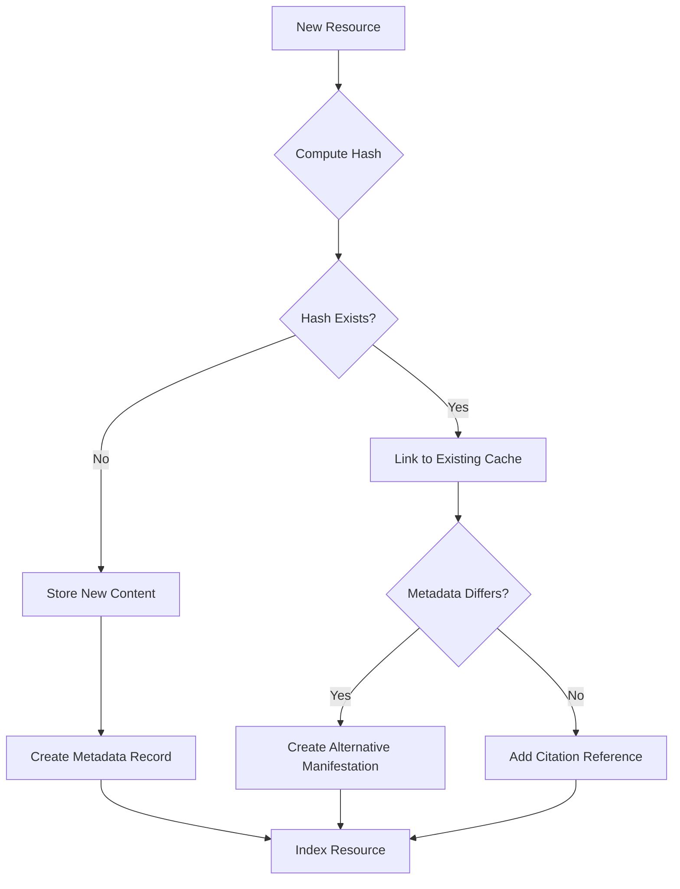

# Universal Resource Library - Design Document

*Created: 2026-01-05*
*Librarian: Design specification for comprehensive resource management*

---

## Executive Summary

This document defines the architecture for a universal resource library system capable of managing diverse media types - research papers, URLs, books, films, magazines, images, and any other media - with professional-grade metadata, provenance tracking, and content-addressed deduplication.

**Core Principle**: Every piece of external knowledge gets catalogued once, stored efficiently, and remains traceable to its origin.

---

## 1. Metadata Schema Architecture

### 1.1 Universal Core Schema (Dublin Core Foundation)

Based on the [Dublin Core Metadata Element Set](https://www.dublincore.org/specifications/dublin-core/dces/), which has proven cross-domain applicability since 1995, we adopt the 15-element core with qualifiers:

```yaml
# Universal Core Fields (Dublin Core-aligned)
identifier: string           # Primary key (content hash or DOI/ISBN/URL)
title: string               # Resource title
creator: list[string]       # Authors/creators/directors
contributor: list[string]   # Secondary contributors
publisher: string           # Publishing entity
date: ISO8601               # Publication/creation date
type: ResourceType          # Enum: paper, book, film, image, url, dataset, etc.
format: string              # MIME type or physical format
source: string              # Origin URL or physical location
language: ISO639            # Primary language code
subject: list[string]       # Topics/keywords
description: string         # Abstract or summary
relation: list[string]      # Links to related resources
coverage: string            # Temporal/spatial scope
rights: string              # Copyright/license information
```

### 1.2 Extended Schema (Resource-Type Specific)

Following [Zotero's metadata approach](https://www.zotero.org/support/dev/exposing_metadata) and [FRBR principles](https://www.ifla.org/files/assets/cataloguing/frbr-lrm/frbr-lrm_20160225.pdf), we extend with type-specific metadata:

#### Academic Papers

```yaml
# Extends Universal Core
doi: string                 # Digital Object Identifier
arxiv_id: string            # arXiv identifier
pmid: string                # PubMed ID
journal: string             # Journal name
volume: string              # Volume number
issue: string               # Issue number
pages: string               # Page range
abstract: string            # Full abstract
citations_count: int        # Citation count at fetch time
peer_reviewed: bool         # Peer review status
```

#### Books

```yaml
# Extends Universal Core
isbn: string                # ISBN-10 or ISBN-13
edition: string             # Edition number/description
pages: int                  # Total pages
series: string              # Book series name
volume: int                 # Volume in series
```

#### Films/TV Shows

```yaml
# Extends Universal Core
# Based on PBCore 2.1 standard for audiovisual media
imdb_id: string             # IMDb identifier
runtime: int                # Duration in minutes
directors: list[string]     # Director(s)
cast: list[string]          # Principal actors
genre: list[string]         # Genre classifications
release_date: ISO8601       # Original release date
production_company: string  # Studio/production company
country: list[string]       # Country of origin
language_audio: list[string] # Audio languages
language_subtitle: list[string] # Subtitle languages
aspect_ratio: string        # Video aspect ratio
```

#### Images/Art

```yaml
# Extends Universal Core
artist: string              # Artist name
medium: string              # Physical medium (oil, digital, photo)
dimensions: string          # Physical dimensions
collection: string          # Collection/museum
accession_number: string    # Museum accession number
image_url: string           # High-resolution image URL
thumbnail_url: string       # Thumbnail URL
color_palette: list[string] # Dominant colors (hex codes)
```

#### URLs/Web Resources

```yaml
# Extends Universal Core
domain: string              # Domain name
fetched: ISO8601            # First fetch timestamp
last_accessed: ISO8601      # Most recent access
access_count: int           # Number of accesses
http_status: int            # Last HTTP status code
content_hash: string        # SHA-256 of content
content_type: string        # MIME type from headers
freshness_policy: string    # Cache duration (e.g., "7d", "30d")
archived_url: string        # Archive.org Wayback URL if available
```

### 1.3 Provenance Metadata (All Resources)

```yaml
# Tracking metadata (applies to all resources)
catalogued: ISO8601         # When added to library
catalogued_by: string       # Agent/session ID that added it
discovered_context: string  # Why it was accessed
cited_by: list[Citation]    # What references this resource
related_resources: list[string] # Related resource IDs
tags: list[string]          # User-defined tags
collections: list[string]   # Collections this belongs to
notes: string               # Librarian notes
```

### 1.4 Storage Metadata

```yaml
# Internal storage tracking
content_hash: string        # SHA-256 hash (content addressing)
cache_path: string          # Local cache file path
size_bytes: int             # File size
checksum: string            # Additional verification hash
versions: list[Version]     # Version history
last_verified: ISO8601      # Last integrity check
```

---

## 2. Professional Citation Management Insights

### 2.1 Zotero's Architecture

From [Zotero documentation](https://www.zotero.org/support/dev/exposing_metadata), key insights:

1. **Multiple Standard Support**: Zotero supports COinS (ContextObjects in Spans), Highwire Press tags, Dublin Core RDFa, and unAPI for maximum interoperability
2. **Vocabulary Flexibility**: Supports BibTeX, RIS, EndNote/Refer formats alongside RDF vocabularies
3. **Extra Field Pattern**: Uses `CSL variable: value` format in an "Extra" field for non-standard metadata
4. **Automatic Metadata Retrieval**: DOI/ISBN detection in PDFs enables automatic metadata fetch

### 2.2 BibTeX Citation Model

From [BibTeX format specifications](https://www.bibtex.com/g/bibtex-format/):

1. **Entry Types**: 14 standard types (@article, @book, @inproceedings, @techreport, etc.)
2. **Citation Keys**: Author-year format (e.g., `sackson1969`) for stable references
3. **Required vs Optional Fields**: Type-specific mandatory fields ensure minimum quality
4. **Style Independence**: Separation of data from presentation enables format flexibility

**Adoption**: We'll generate BibTeX-compatible citation keys for all resources.

### 2.3 CSL-JSON for Modern Citation

Citation Style Language JSON is the modern standard for citation data:

```json
{
  "id": "sackson1969",
  "type": "book",
  "title": "A Gamut of Games",
  "author": [{"family": "Sackson", "given": "Sid"}],
  "issued": {"date-parts": [[1969]]},
  "publisher": "Random House"
}
```

We'll maintain CSL-JSON export capability for integration with modern citation processors.

---

## 3. Library Science Principles

### 3.1 FRBR Model (Functional Requirements for Bibliographic Records)

From [IFLA's FRBR specification](https://en.wikipedia.org/wiki/Functional_Requirements_for_Bibliographic_Records):

**Four-Level Entity Model (WEMI)**:

1. **Work**: Abstract intellectual/artistic creation (e.g., "The concept of Pride and Prejudice")
2. **Expression**: Specific realization of work (e.g., "English edition", "French translation")
3. **Manifestation**: Physical embodiment (e.g., "2015 Penguin paperback")
4. **Item**: Individual copy (e.g., "The copy in my library")

**Application to Our Library**:

```yaml
# Example: Academic paper with multiple versions
work_id: "shannon-information-theory"
expressions:
  - expression_id: "shannon-1948-original"
    language: "en"
    abstract: "A Mathematical Theory of Communication"
    manifestations:
      - manifestation_id: "bell-system-1948"
        format: "journal-article"
        source: "Bell System Technical Journal"
      - manifestation_id: "pdf-scan-2010"
        format: "application/pdf"
        source: "https://example.com/shannon.pdf"
  - expression_id: "shannon-1948-russian"
    language: "ru"
    manifestations:
      - manifestation_id: "soviet-1953"
        format: "journal-article"
```

This enables:
- Clustering of related versions
- Language/format variant tracking
- Work-level citations that encompass all versions

### 3.2 User Task Model

FRBR defines four user tasks (from [Library of Congress FRBR materials](https://www.loc.gov/catdir/cpso/frbreng.pdf)):

1. **Find**: Locate resources matching search criteria
2. **Identify**: Confirm a resource is the correct one
3. **Select**: Determine if resource meets user needs
4. **Obtain**: Acquire access to the resource

**Design Implication**: Our index structure must optimize for these tasks:

- **Find**: Full-text search, faceted search by type/topic/author
- **Identify**: Rich metadata display, content hashes, DOI/ISBN verification
- **Select**: Abstracts, thumbnails, quality indicators (peer-reviewed, citation count)
- **Obtain**: Direct links, cached copies, alternative sources

### 3.3 Authority Control

Maintain authority files for:
- **Authors/Creators**: Resolve name variants (e.g., "T.S. Eliot", "Thomas Stearns Eliot")
- **Subjects**: Controlled vocabulary/thesaurus
- **Publishers**: Canonical publisher names

### 3.4 Ranganathan's Five Laws (Applied)

From [FRBR's connection to classical principles](https://en.wikipedia.org/wiki/Functional_Requirements_for_Bibliographic_Records):

1. **Resources are for use** → Optimize for retrieval, not just storage
2. **Every resource has its user** → Support diverse access patterns
3. **Every resource deserves its user** → Rich metadata enables discovery
4. **Save the time of the user** → Deduplication prevents redundant work
5. **A library is a growing organism** → Schema must be extensible

---

## 4. Provenance and Citation Graph Tracking

### 4.1 Citation Chain Model

```yaml
resource_id: "shannon-1948"
cited_by:
  - type: "journal-entry"
    entry_id: "2025-12-15-information-theory-research"
    timestamp: "2025-12-15T14:30:00Z"
    agent: "journal:scribe"
    context: "Background research for entropy discussion"

  - type: "session-log"
    session_id: "2025-12-15-10-30-a1b2c3d4"
    timestamp: "2025-12-15T10:30:00Z"
    agent: "awareness:mentor"
    context: "Referenced while studying communication theory"

  - type: "internal-document"
    document_path: ".claude/planning/2025-12-20-information-architecture.md"
    line_number: 45
    timestamp: "2025-12-20T16:00:00Z"
    agent: "agent-architect"
    context: "Cited as foundational work for system design"

cites:
  - resource_id: "nyquist-1924"
    relationship: "builds_on"
  - resource_id: "hartley-1928"
    relationship: "builds_on"
```

### 4.2 Citation Graph Queries

Enable queries like:
- "What influenced this work?" (backward citations)
- "What has cited this?" (forward citations)
- "What works are frequently cited together?" (co-citation analysis)
- "What's the citation path between two works?" (graph traversal)

### 4.3 Provenance Tracking Standards

Follow [W3C PROV-DM](https://www.w3.org/TR/prov-dm/) principles:
- **Entity**: The resource itself
- **Activity**: Actions taken with resource (fetch, read, cite)
- **Agent**: Who performed the activity
- **Time**: When it occurred

```turtle
# Example in PROV-N notation
entity(shannon-1948)
activity(fetch-2025-12-15, 2025-12-15T14:30:00Z)
agent(librarian-agent)
wasGeneratedBy(shannon-1948-cached, fetch-2025-12-15)
wasAttributedTo(fetch-2025-12-15, librarian-agent)
used(journal-entry-2025-12-15, shannon-1948-cached)
```

---

## 5. File Organization Architecture

### 5.1 Directory Structure

```
.claude/library/
├── index.md                          # Master index (human-readable)
├── catalog.json                      # Machine-readable catalog
├── citations.json                    # Citation graph data
├── design.md                         # This document
├── README.md                         # Library overview
├── MANIFEST.md                       # Complete resource listing
│
├── schemas/                          # Schema definitions
│   ├── core.yaml                     # Universal core schema
│   ├── paper.yaml                    # Academic paper schema
│   ├── book.yaml                     # Book schema
│   ├── film.yaml                     # Film/TV schema
│   ├── image.yaml                    # Image/art schema
│   └── url.yaml                      # Web resource schema
│
├── resources/                        # Resource metadata files
│   ├── papers/
│   │   ├── by-author/
│   │   │   ├── shannon/
│   │   │   │   └── shannon-1948-information-theory.yaml
│   │   │   └── turing/
│   │   │       └── turing-1936-computable-numbers.yaml
│   │   ├── by-year/
│   │   │   ├── 1948/
│   │   │   └── 2025/
│   │   ├── by-topic/
│   │   │   ├── information-theory/
│   │   │   ├── machine-learning/
│   │   │   └── knowledge-graphs/
│   │   └── by-venue/
│   │       ├── bell-system-technical-journal/
│   │       └── nature/
│   │
│   ├── books/
│   │   ├── by-author/
│   │   ├── by-year/
│   │   ├── by-topic/
│   │   └── by-isbn/              # Canonical location
│   │
│   ├── films/
│   │   ├── by-director/
│   │   ├── by-year/
│   │   ├── by-genre/
│   │   └── by-imdb/              # Canonical location
│   │
│   ├── images/
│   │   ├── by-artist/
│   │   ├── by-collection/
│   │   └── by-hash/              # Canonical location
│   │
│   ├── urls/
│   │   ├── by-domain/
│   │   │   ├── github.com.yaml
│   │   │   ├── arxiv.org.yaml
│   │   │   └── claude.com.yaml
│   │   ├── by-topic/
│   │   │   ├── agent-development.yaml
│   │   │   └── documentation.yaml
│   │   └── by-hash/              # Canonical location
│   │
│   └── datasets/
│       ├── by-provider/
│       └── by-topic/
│
├── collections/                      # Curated collections
│   ├── reading-lists/
│   │   ├── agent-architectures-2025.yaml
│   │   └── temporal-knowledge-graphs.yaml
│   ├── research-projects/
│   │   └── conductor-development.yaml
│   └── references/
│       └── ecosystem-foundations.yaml
│
├── authorities/                      # Authority control
│   ├── creators.yaml                 # Canonical creator names
│   ├── subjects.yaml                 # Controlled vocabulary
│   └── publishers.yaml               # Publisher authority file
│
├── exports/                          # Export formats
│   ├── bibtex/
│   │   └── complete.bib              # Full BibTeX export
│   ├── csl-json/
│   │   └── complete.json             # CSL-JSON export
│   └── rdf/
│       └── complete.ttl              # RDF/Turtle export
│
└── .cache/                           # Content-addressed storage
    ├── objects/                      # Content-addressed objects
    │   ├── ab/
    │   │   └── cd1234.../            # First 2 chars of hash
    │   │       ├── content           # Original content
    │   │       ├── metadata.yaml     # Storage metadata
    │   │       └── verified          # Verification timestamp
    │   └── ef/
    │       └── 5678ab.../
    │           └── content
    ├── index/                        # Cache index
    │   ├── by-url.db                 # URL → hash mapping
    │   └── by-hash.db                # Hash → metadata mapping
    └── temp/                         # Temporary downloads
```

### 5.2 Canonical vs Faceted Organization

**Principle**: Each resource has ONE canonical location (by primary identifier), with symlinks or references for faceted access.

**Example**:
- Canonical: `resources/papers/by-doi/10.1002-j.1538-7305.1948.tb01338.x.yaml`
- Faceted views link to canonical location:
  - `resources/papers/by-author/shannon/` → symlink to canonical
  - `resources/papers/by-topic/information-theory/` → symlink to canonical

### 5.3 Content-Addressed Cache

Following [Git's object model](https://lab.abilian.com/Tech/Databases%20&%20Persistence/Content%20Addressable%20Storage%20(CAS)/) and [IPFS principles](https://grokipedia.com/page/Content-addressable_storage):

**Content Addressing**:
1. Compute SHA-256 hash of content
2. Store at `.cache/objects/{first-2-chars}/{remaining-hash}/content`
3. Multiple resources with identical content share same cache object
4. Immutable: content never changes; updates create new hash

**Versioning**:
```yaml
# In resource metadata file
resource_id: "python-docs-requests"
versions:
  - hash: "abc123..."
    timestamp: "2025-12-01T00:00:00Z"
    cache_path: ".cache/objects/ab/c123.../content"
  - hash: "def456..."
    timestamp: "2025-12-15T00:00:00Z"
    cache_path: ".cache/objects/de/f456.../content"
    notes: "Updated for requests 2.32.0"
```

**Deduplication Benefits**:
- Identical PDFs from different URLs stored once
- Version history without storage penalty
- Integrity verification via hash matching

### 5.4 Freshness Policies

```yaml
# Per-domain freshness configuration
domains:
  arxiv.org:
    freshness: "never"          # Papers never change
    recrawl: false

  docs.python.org:
    freshness: "30d"             # Docs update monthly
    recrawl: true

  github.com:
    freshness: "7d"              # Repos change frequently
    recrawl: true

  news.ycombinator.com:
    freshness: "24h"             # News is ephemeral
    recrawl: true
```

---

## 6. Handling Duplicates and Versioning

### 6.1 Duplicate Detection Strategy

**Level 1: Content Hash (Exact Match)**
```python
def is_exact_duplicate(resource):
    content_hash = sha256(resource.content)
    return library.cache.has_object(content_hash)
```

**Level 2: Identifier Match (Same Work)**
```python
def is_same_work(resource):
    # Check DOI, ISBN, URL, etc.
    if resource.doi:
        return library.find_by_doi(resource.doi)
    if resource.isbn:
        return library.find_by_isbn(resource.isbn)
    if resource.url:
        return library.find_by_url(resource.url)
    return None
```

**Level 3: Fuzzy Match (Similar Works)**
```python
def find_similar(resource):
    # Title similarity + author matching
    candidates = library.search_by_title_fuzzy(resource.title, threshold=0.9)
    return [c for c in candidates if author_overlap(c, resource) > 0.5]
```

### 6.2 Versioning Strategy

**For Immutable Resources (Papers, Books)**:
- Single metadata record
- Multiple manifestations linked via FRBR expressions
- Content hash tracks each version

**For Mutable Resources (URLs, Documentation)**:
- Snapshot history with timestamps
- Current version is latest hash
- Old versions retained for citation stability

**For Serial Resources (Journals, TV Series)**:
- Parent work record
- Child records for each issue/episode
- Series-level metadata inherited

### 6.3 Deduplication Workflow



### 6.4 Merge Conflicts

When duplicate resources are discovered after cataloguing:

```yaml
# Conflict resolution record
conflict_id: "conflict-2025-12-15-001"
status: "resolved"
resources:
  - resource_id: "resource-001"
    metadata_file: "papers/by-author/shannon/shannon-1948.yaml"
  - resource_id: "resource-002"
    metadata_file: "papers/by-doi/10.1002-j.1538-7305.1948.yaml"
resolution:
  action: "merge"
  canonical: "resource-002"  # DOI-based is canonical
  merged_into: "resource-002"
  aliases:
    - "resource-001"
  merged_fields:
    - field: "tags"
      combined: true  # Union of both tag sets
    - field: "notes"
      combined: true  # Concatenate notes
    - field: "cited_by"
      combined: true  # Merge citation lists
  timestamp: "2025-12-15T16:00:00Z"
  merged_by: "librarian"
```

---

## 7. Implementation Priorities

### Phase 1: Foundation (Weeks 1-2)
- [ ] Implement core schema (Dublin Core + extensions)
- [ ] Build content-addressed cache system
- [ ] Create basic CRUD operations for resources
- [ ] Implement URL cataloguing with existing data migration

### Phase 2: Academic Resources (Weeks 3-4)
- [ ] Paper metadata schema and storage
- [ ] DOI/arXiv integration for automatic metadata fetch
- [ ] BibTeX export functionality
- [ ] Citation graph data structure

### Phase 3: Multimedia (Weeks 5-6)
- [ ] Book metadata (ISBN integration)
- [ ] Film/TV metadata (IMDb API consideration)
- [ ] Image cataloguing with thumbnail generation
- [ ] PBCore 2.1 support for audiovisual

### Phase 4: Advanced Features (Weeks 7-8)
- [ ] FRBR work-expression-manifestation hierarchy
- [ ] Authority control for creators/subjects
- [ ] Fuzzy duplicate detection
- [ ] Collection management
- [ ] Full-text search with Tantivy or MeiliSearch

### Phase 5: Integration (Weeks 9-10)
- [ ] Archivist integration (cross-reference internal/external)
- [ ] Journal integration (auto-link cited resources)
- [ ] Knowledge graph export (temporal-validator)
- [ ] Web UI for browsing library

---

## 8. Technology Recommendations

### Storage Layer
- **Metadata**: YAML files for human readability + Git-friendly diffs
- **Cache Index**: SQLite for fast lookups (URL→hash, hash→path)
- **Content**: Content-addressed filesystem objects
- **Full-text Search**: Tantivy (Rust) or MeiliSearch for production

### API Layer
```python
# Python API sketch
from library import Library

lib = Library("

# Add resource
paper = lib.add_paper(
    doi="10.1002/j.1538-7305.1948.tb01338.x",
    auto_fetch_metadata=True
)

# Check for duplicates
if lib.has_resource(url="https://example.com/shannon.pdf"):
    cached = lib.get_by_url(url)
else:
    cached = lib.fetch_and_cache(url)

# Citation tracking
lib.add_citation(
    resource=paper,
    cited_by="journal-entry-2025-12-15",
    context="Background research"
)

# Search
results = lib.search(
    query="information theory",
    filters={"type": "paper", "year_range": (1940, 1960)}
)

# Export
lib.export_bibtex("exports/bibtex/complete.bib")
```

### CLI Interface
```bash
# Librarian CLI
librarian add paper --doi 10.1002/j.1538-7305.1948.tb01338.x
librarian add url https://example.com --topic "agent-development"
librarian search "information theory" --type paper --year 1940-1960
librarian cite resource-001 journal-entry-2025-12-15
librarian export --format bibtex --output refs.bib
librarian stats
librarian deduplicate --dry-run
```

---

## 9. Standards and Interoperability

### 9.1 Import Formats Supported
- BibTeX (`.bib`)
- RIS (`.ris`)
- EndNote XML
- CSL-JSON
- Zotero RDF
- Dublin Core XML

### 9.2 Export Formats Supported
- BibTeX
- CSL-JSON
- RIS
- RDF/Turtle
- Markdown (for documentation)
- JSON (for APIs)

### 9.3 API Integrations
- CrossRef (DOI metadata)
- arXiv API (preprint metadata)
- OpenAlex (academic paper metadata)
- Internet Archive (archival URLs)
- ORCID (author identifiers)
- Library of Congress (authority control)

---

## 10. Quality Assurance

### 10.1 Metadata Quality Metrics
- **Completeness**: Required fields filled
- **Accuracy**: Identifiers verified (DOI resolves, ISBN valid)
- **Consistency**: Format standards followed
- **Currency**: Freshness policy respected
- **Uniqueness**: No undetected duplicates

### 10.2 Integrity Checks
```bash
# Daily integrity check
librarian verify --all
  ✓ Content hashes match (12,543 objects)
  ✓ No orphaned cache objects
  ✓ All symlinks valid
  ✗ 3 resources missing required fields
  ✗ 1 broken URL detected

# Repair
librarian repair --fix-metadata --refetch-broken
```

### 10.3 Audit Trail
Every modification logged:
```yaml
audit_log:
  - timestamp: "2025-12-15T14:30:00Z"
    action: "resource_added"
    resource_id: "shannon-1948"
    agent: "librarian"
    details: "Added via DOI auto-fetch"

  - timestamp: "2025-12-15T14:35:00Z"
    action: "citation_added"
    resource_id: "shannon-1948"
    citing_document: "journal-entry-2025-12-15"
    agent: "journal:scribe"
```

---

## 11. Connection to Ecosystem

### 11.1 Integration with Archivist
- **Archivist**: Internal artifacts (`.claude/archive/`)
- **Librarian**: External resources (`.claude/library/`)
- **Cross-reference**: Journal entries cite both internal artifacts and external resources

### 11.2 Integration with Knowledge Graphs
- Export citation graph to FalkorDB/Graphiti
- SPARQL endpoint for semantic queries
- Temporal dimension tracking (when knowledge was added/updated)

### 11.3 Integration with Journal
- Auto-link citations in journal entries
- Generate "Resources Cited" section in daily summaries
- Track which sessions accessed which resources

### 11.4 Integration with Agents
- Agents query library before web fetch
- Cache hits prevent redundant network requests
- Citation context recorded automatically

---

## 12. Success Metrics

### Efficiency
- **Cache Hit Rate**: >70% of resource requests served from cache
- **Deduplication Ratio**: Average 2.5 manifestations per work
- **Storage Efficiency**: >50% reduction vs naive storage

### Quality
- **Metadata Completeness**: >90% of resources have all required fields
- **Citation Coverage**: >80% of external references tracked
- **Accuracy**: <1% broken links, <0.1% hash mismatches

### Usage
- **Resources Catalogued**: Growth trajectory
- **Most Accessed Resources**: Top 10 per month
- **Topic Distribution**: Balanced coverage across domains
- **Agent Adoption**: % of WebFetch calls going through librarian

---

## 13. Future Enhancements

### Near-term (Q1 2026)
- Full-text extraction and indexing
- Automatic related resource suggestions
- Citation network visualization (D3.js graph)
- RSS feed monitoring for new papers in tracked venues

### Mid-term (Q2-Q3 2026)
- Machine learning for metadata completion
- Semantic similarity search (embeddings)
- Collaborative filtering ("users who cited X also cited Y")
- Integration with Obsidian plugin for citation lookup

### Long-term (Q4 2026+)
- Distributed library federation (share with other ecosystems)
- Blockchain-based provenance timestamps
- IPFS integration for content distribution
- Academic paper recommendation system

---

## Sources

This design draws from:

- [Zotero Metadata Documentation](https://www.zotero.org/support/dev/exposing_metadata) - Citation management metadata standards
- [Dublin Core Metadata Element Set](https://www.dublincore.org/specifications/dublin-core/dces/) - Universal metadata schema
- [Dublin Core Metadata Initiative](https://www.dublincore.org/) - Metadata innovation and standards
- [BibTeX Format Specification](https://www.bibtex.com/g/bibtex-format/) - Academic citation format
- [BibTeX Entry Types](https://www.bibtex.com/e/entry-types/) - Complete list of citation types
- [FRBR (Functional Requirements for Bibliographic Records)](https://en.wikipedia.org/wiki/Functional_Requirements_for_Bibliographic_Records) - Library cataloging model
- [IFLA FRBR-LRM](https://www.ifla.org/files/assets/cataloguing/frbr-lrm/frbr-lrm_20160225.pdf) - Library reference model
- [UCLA Media Archival Studies - Cataloging](https://guides.library.ucla.edu/mas/cataloging) - Multimedia cataloging guidance
- [CLIR Digital Video Archives](https://www.clir.org/pubs/reports/pub106/video/) - Video archive metadata management
- [Content-Addressable Storage Overview](https://lab.abilian.com/Tech/Databases%20&%20Persistence/Content%20Addressable%20Storage%20(CAS)/) - CAS architecture
- [Data Deduplication on Wikipedia](https://en.wikipedia.org/wiki/Data_deduplication) - Deduplication techniques
- [OCLC FRBR Research](https://www.oclc.org/research/activities/frbr.html) - Practical FRBR applications
- [Library of Congress FRBR Materials](https://www.loc.gov/catdir/cpso/frbreng.pdf) - FRBR implementation guidance

---

*This design document will evolve as the library system develops. Version history tracked in Git.*
